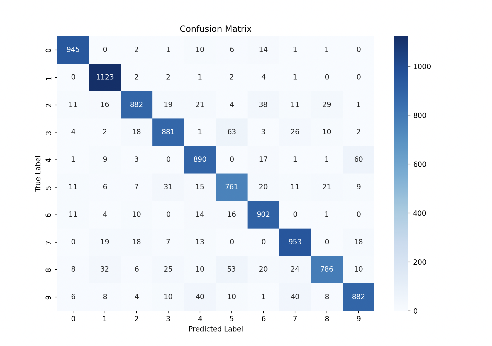

# Rozpoznawanie cyfr za pomocą sieci neuronowej w Keras

## Opis projektu

Celem tego projektu było stworzenie i wytrenowanie sieci neuronowej zdolnej do rozpoznawania cyfr ze zbioru MNIST. Wykorzystano bibliotekę Keras oraz TensorFlow jako backend do implementacji i trenowania modelu.

## Zbiór danych MNIST

Zbiór MNIST składa się z 60 000 obrazów cyfr od 0 do 9 w rozdzielczości 28x28 pikseli, podzielonych na zbiór treningowy oraz testowy. Model został wytrenowany na zbiorze treningowym i oceniony na 10 000 obrazów testowych.

## Implementacja

Do stworzenia modelu użyto sieci neuronowej opartej na warstwach konwolucyjnych (CNN). Proces implementacji obejmował:
- Wczytanie i normalizację danych MNIST,
- Definiowanie architektury sieci w Keras,
- Trenowanie modelu na zbiorze treningowym,
- Ewaluację wyników na zbiorze testowym.

Model został zapisany i ponownie załadowany do testowania.

## Wyniki

Testowanie modelu wykazało następujące wyniki:

- **Test Loss:** 0.3717
- **Test Accuracy:** 90.05%

Dodatkowo, klasyfikator uzyskał następujące wartości precyzji i czułości:

| Cyfra | Precyzja | Czułość | F1-score | Próbki |
|-------|----------|---------|----------|--------|
| 0     | 0.95     | 0.96    | 0.96     | 980    |
| 1     | 0.92     | 0.99    | 0.95     | 1135   |
| 2     | 0.93     | 0.85    | 0.89     | 1032   |
| 3     | 0.90     | 0.87    | 0.89     | 1010   |
| 4     | 0.88     | 0.91    | 0.89     | 982    |
| 5     | 0.83     | 0.85    | 0.84     | 892    |
| 6     | 0.89     | 0.94    | 0.91     | 958    |
| 7     | 0.89     | 0.93    | 0.91     | 1028   |
| 8     | 0.92     | 0.81    | 0.86     | 974    |
| 9     | 0.90     | 0.87    | 0.89     | 1009   |
| **Średnia** | **0.90** | **0.90** | **0.90** | **10000** |

## Macierz pomyłek
Poniżej znajduje się macierz pomyłek dla wytrenowanego modelu:

## Wnioski

Model osiągnął dokładność 90% na zbiorze testowym, co wskazuje na dobrą zdolność klasyfikacyjną.
