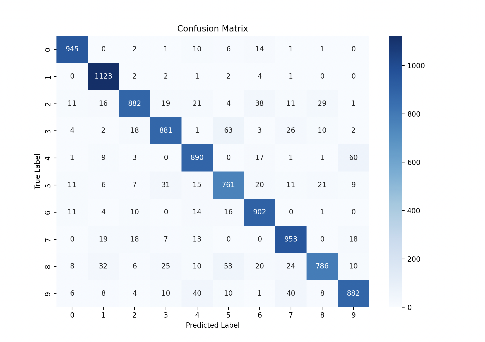
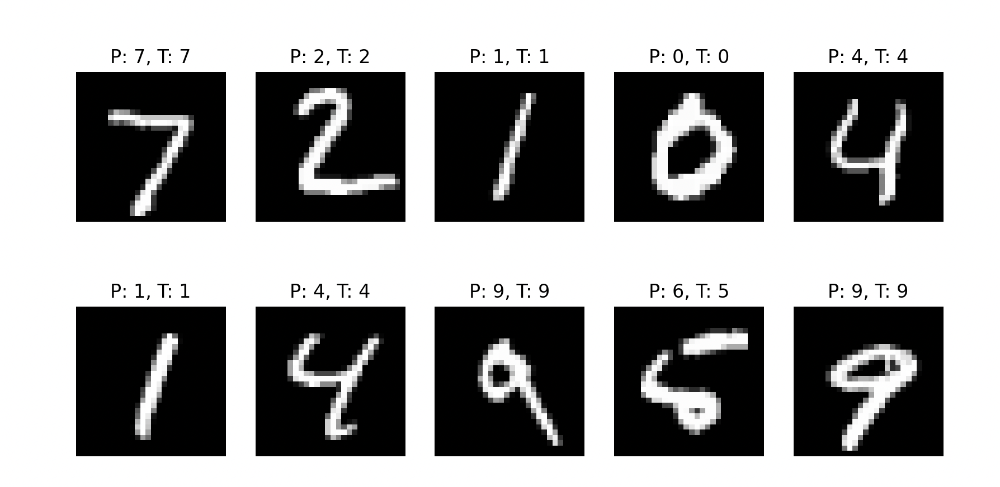
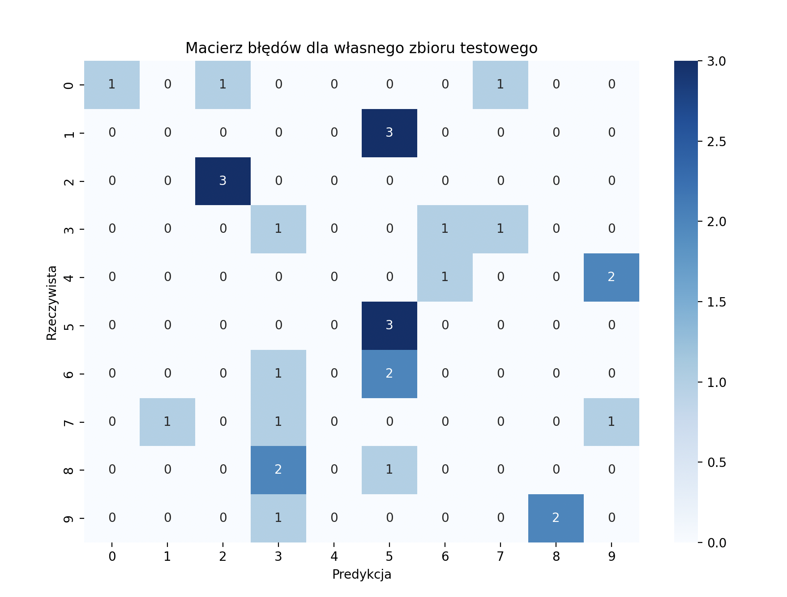
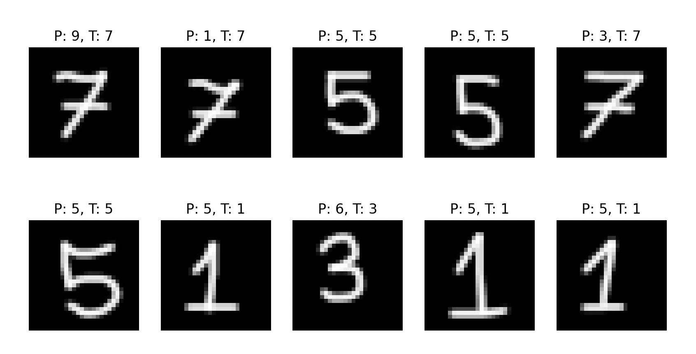

# Digit Recognition Using a Neural Network in Keras

## Project Description

The goal of this project was to create and train a neural network capable of recognizing digits from the MNIST dataset. The Keras library was used along with TensorFlow as the backend for implementing and training the model.

## MNIST Dataset

The MNIST dataset consists of 60,000 images of digits from 0 to 9 with a resolution of 28x28 pixels, divided into training and test sets. The model was trained on the training set and evaluated on 10,000 test images.

## Implementation

The model was created using a neural network based on convolutional layers (CNN). The implementation process included:
- Loading and normalizing the MNIST data,
- Defining the network architecture in Keras,
- Training the model on the training set,
- Evaluating the results on the test set.

The model was saved and reloaded for testing.

# Results

## 1. Evaluation on MNIST Test Set

Testing the model yielded the following results:

- **Test Loss:** 0.3717
- **Test Accuracy:** 90.05%

Additionally, the classifier achieved the following precision and recall values:

| Digit | Precision | Recall | F1-score | Samples |
|-------|-----------|--------|----------|---------|
| 0     | 0.95      | 0.96   | 0.96     | 980     |
| 1     | 0.92      | 0.99   | 0.95     | 1135    |
| 2     | 0.93      | 0.85   | 0.89     | 1032    |
| 3     | 0.90      | 0.87   | 0.89     | 1010    |
| 4     | 0.88      | 0.91   | 0.89     | 982     |
| 5     | 0.83      | 0.85   | 0.84     | 892     |
| 6     | 0.89      | 0.94   | 0.91     | 958     |
| 7     | 0.89      | 0.93   | 0.91     | 1028    |
| 8     | 0.92      | 0.81   | 0.86     | 974     |
| 9     | 0.90      | 0.87   | 0.89     | 1009    |
| **Average** | **0.90**  | **0.90** | **0.90** | **10000** |

### Confusion Matrix
Below is the confusion matrix for the trained model:

### Predictions

### Conclusions

The model achieved 90% accuracy on the test set, indicating good classification performance.

----
## 2. Evaluation on Custom Handwritten Digits

### 2. Evaluation on Custom Handwritten Digits

To test the model's generalization capabilities, a custom test set was created containing 3 handwritten samples of each digit (0–9), saved as 28x28 pixel images. These images were processed to match the format of MNIST (grayscale, inverted, normalized).

- **Number of samples:** 30  
- **Test Accuracy on custom data:** 26.67%

Below is the classification report:

| Digit | Precision | Recall | F1-score | Support |
|-------|-----------|--------|----------|---------|
| 0     | 1.00      | 0.33   | 0.50     | 3       |
| 1     | 0.00      | 0.00   | 0.00     | 3       |
| 2     | 0.75      | 1.00   | 0.86     | 3       |
| 3     | 0.17      | 0.33   | 0.22     | 3       |
| 4     | 0.00      | 0.00   | 0.00     | 3       |
| 5     | 0.33      | 1.00   | 0.50     | 3       |
| 6     | 0.00      | 0.00   | 0.00     | 3       |
| 7     | 0.00      | 0.00   | 0.00     | 3       |
| 8     | 0.00      | 0.00   | 0.00     | 3       |
| 9     | 0.00      | 0.00   | 0.00     | 3       |
| **Average** | **0.23** | **0.27** | **0.21** | **30** |

### Confusion Matrix

### Predictions

### Observations:
- Only a few digits (e.g. 2 and 5) were consistently recognized.
- Many digits were not predicted at all, resulting in undefined precision for those classes.
- Handwritten digits differ significantly from MNIST’s clean and centered format.

### Potential Improvements:
- Increase the size of the handwritten dataset (e.g. 20+ samples per digit).
- Perform data augmentation (rotation, shifting, zooming).
- Fine-tune the existing model by training it further using the custom digit dataset.

