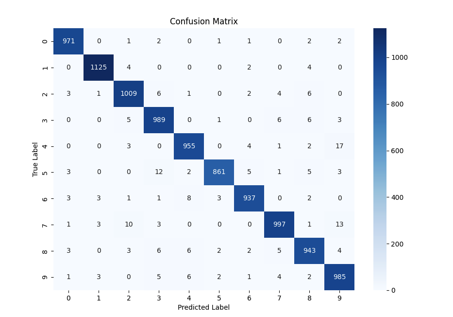
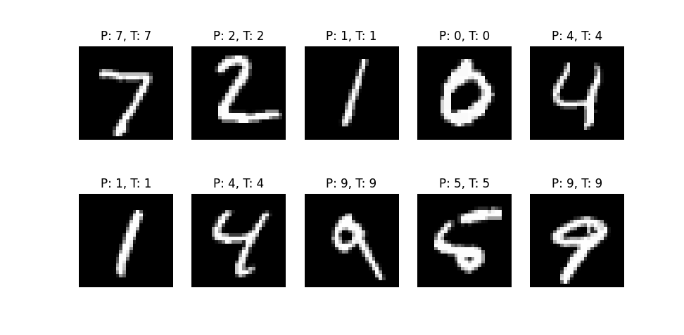
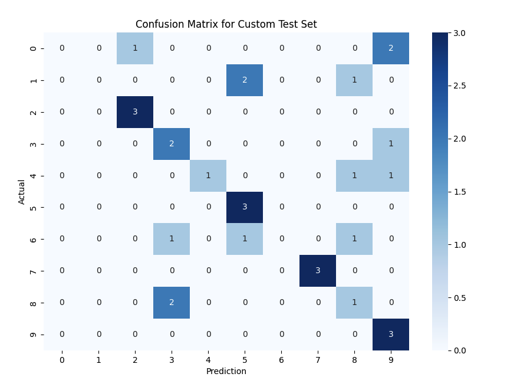
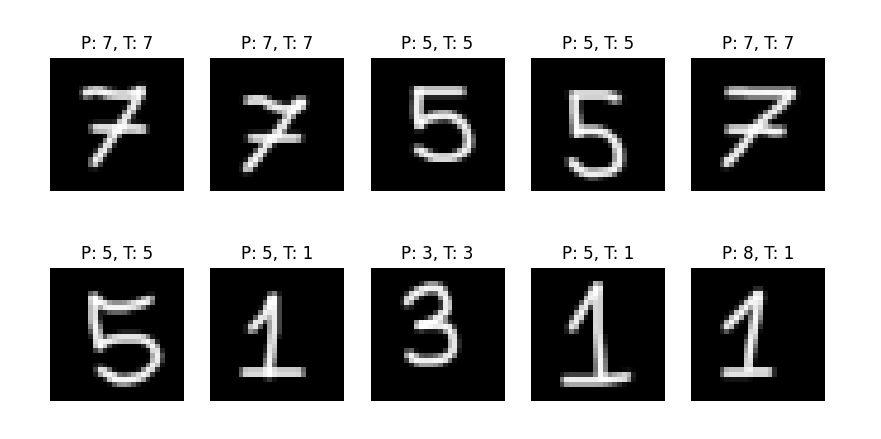

# Digit Recognition Using a Neural Network in Keras

## Project Description

The goal of this project is to create and train a neural network capable of recognizing digits from the MNIST dataset. The Keras library was used along with TensorFlow (macOS version) as the backend for implementing and training the model.

## MNIST Dataset

The MNIST dataset consists of 60,000 grayscale images of handwritten digits (0–9), each of size 28x28 pixels, with an additional 10,000 images for testing.

## Implementation

The model is a fully connected feedforward neural network. The implementation included:

- Loading and preprocessing the MNIST data,
- Normalizing pixel values (0–255 → 0–1),
- Flattening 28x28 images into 784-length vectors,
- Defining the network architecture using Keras Sequential API,
- Training the model on the training set for 10 epochs,
- Saving the trained model to an `.h5` file,
- Loading the model and evaluating it on the test set.

## Model Architecture

- **Input Layer:** 784 neurons (flattened 28x28 images)
- **Hidden Layer 1:** Dense(128), ReLU
- **Hidden Layer 2:** Dense(128), ReLU
- **Dropout Layer:** Dropout(0.25)
- **Output Layer:** Dense(10), Softmax

## Results

### 1. Evaluation on MNIST Test Set

- **Test Loss:** 0.0757  
- **Test Accuracy:** 97.72%

### 2. Classification Report

| Digit | Precision | Recall | F1-score | Support |
|-------|-----------|--------|----------|---------|
| 0     | 0.99      | 0.99   | 0.99     | 980     |
| 1     | 0.99      | 0.99   | 0.99     | 1135    |
| 2     | 0.97      | 0.98   | 0.98     | 1032    |
| 3     | 0.97      | 0.98   | 0.97     | 1010    |
| 4     | 0.98      | 0.97   | 0.97     | 982     |
| 5     | 0.99      | 0.97   | 0.98     | 892     |
| 6     | 0.98      | 0.98   | 0.98     | 958     |
| 7     | 0.98      | 0.97   | 0.97     | 1028    |
| 8     | 0.97      | 0.97   | 0.97     | 974     |
| 9     | 0.96      | 0.98   | 0.97     | 1009    |
| **Average  Total** | **0,98** | **0.98** | **0.98** | **10,000** |

### 3. Confusion Matrix

### 4. Sample Predictions

## Conclusion

The neural network achieved **97.72% accuracy** on the MNIST test set, demonstrating excellent performance for handwritten digit recognition using a relatively simple architecture.

----
## 2. Evaluation on Custom Handwritten Digits

To test the model's generalization capabilities, a custom test set was created containing 3 handwritten samples of each digit (0–9), saved as 28x28 pixel images. These images were preprocessed to match the format of MNIST (grayscale, inverted, and normalized).

- **Number of samples:** 30  
- **Test Accuracy on custom data:** 70.00%

### Classification Report

| Digit | Precision | Recall | F1-score | Support |
|-------|-----------|--------|----------|---------|
| 0     | 1.00      | 0.67   | 0.80     | 3       |
| 1     | 1.00      | 0.33   | 0.50     | 3       |
| 2     | 0.75      | 1.00   | 0.86     | 3       |
| 3     | 0.50      | 0.67   | 0.57     | 3       |
| 4     | 1.00      | 0.67   | 0.80     | 3       |
| 5     | 1.00      | 1.00   | 1.00     | 3       |
| 6     | 0.00      | 0.00   | 0.00     | 3       |
| 7     | 0.50      | 1.00   | 0.67     | 3       |
| 8     | 0.50      | 0.67   | 0.57     | 3       |
| 9     | 1.00      | 1.00   | 1.00     | 3       |
| **Average** | **0.72** | **0.70** | **0.68** | **30** |

### Confusion Matrix

### Predictions

### Observations

- Digits like **0, 2, 4, 5, 7, and 9** were recognized very well.
- **Digit 6** was not recognized at all.
- Improvement may be due to better preprocessing, model refinement, or randomness in predictions.

### Potential Improvements

- Increase the size of the custom dataset (e.g., 20+ samples per digit).
- Use data augmentation techniques (rotation, shifting, scaling) during training.
- Fine-tune the existing model by continuing training on the custom dataset.
- Investigate why certain digits (e.g., **6**) fail consistently — maybe add more examples or analyze handwriting style.
