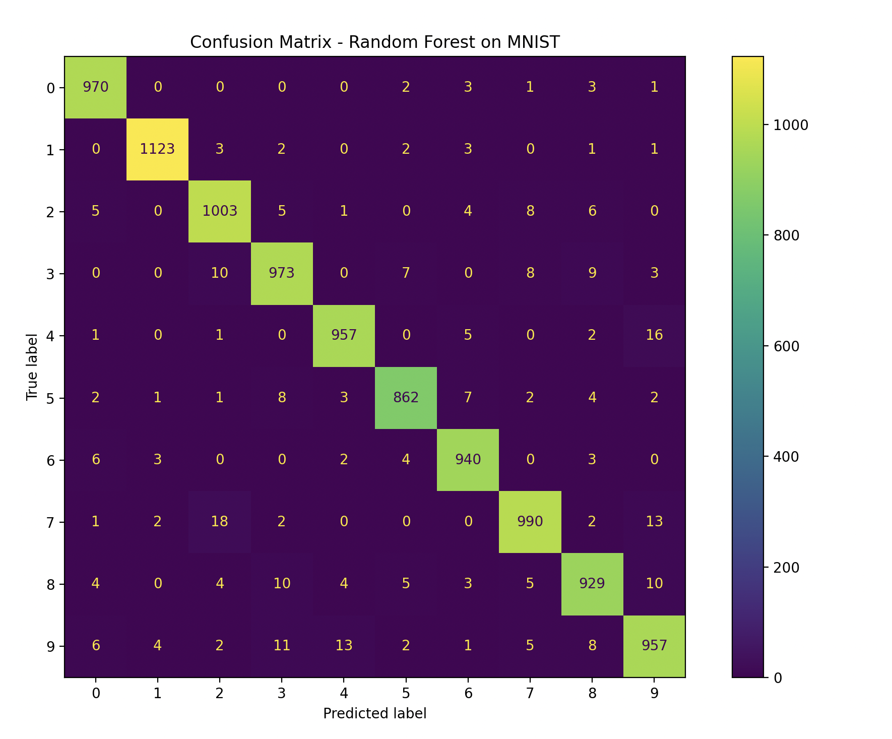
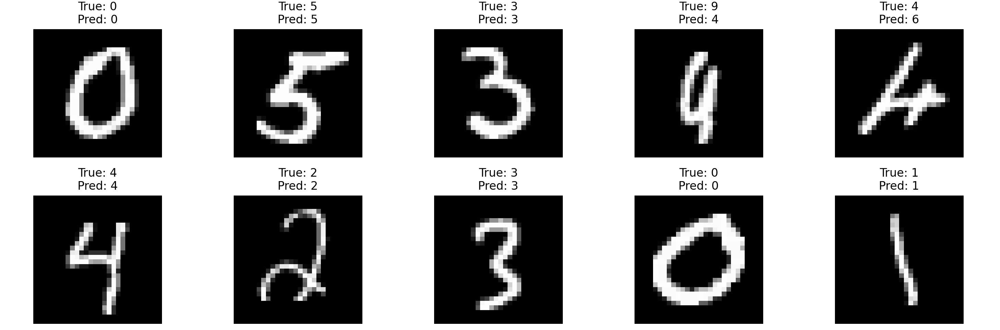

# Random Forest Classifier for Handwritten Digit Recognition (MNIST)

## Project Overview

The goal of this project was to implement a digit classification model using the **Random Forest algorithm** from the `scikit-learn` library. The model was trained and tested on the **MNIST dataset**, which contains grayscale images of handwritten digits from 0 to 9.

Random Forest is an ensemble learning method that operates by constructing multiple decision trees and outputting the class that is the mode of the classes predicted by individual trees. It is robust, fast, and performs well on classification tasks like image recognition.

---

## Dataset: MNIST

- **Size:** 70,000 total samples
  - 60,000 training images
  - 10,000 test images
- **Image shape:** 28×28 pixels
- **Classes:** 10 (digits from 0 to 9)
- **Grayscale:** Values in the range [0, 255]

Each image was flattened to a 784-length vector (28×28) before feeding into the classifier.

---

## Model: Random Forest

- **Library:** scikit-learn
- **Classifier:** `RandomForestClassifier`
- **Number of trees:** 150
- **Criterion:** Gini impurity
- **Random state:** 1

The model was trained using the full training set and evaluated on the full test set without any additional preprocessing or dimensionality reduction.

---

## Results

### Accuracy

The trained model achieved an overall accuracy of **97.04%** on the MNIST test set.

### Classification Report

| Digit | Precision | Recall | F1-score | Support |
|-------|-----------|--------|----------|---------|
| 0     | 0.9749    | 0.9898 | 0.9823   | 980     |
| 1     | 0.9912    | 0.9894 | 0.9903   | 1135    |
| 2     | 0.9626    | 0.9719 | 0.9672   | 1032    |
| 3     | 0.9624    | 0.9634 | 0.9629   | 1010    |
| 4     | 0.9765    | 0.9745 | 0.9755   | 982     |
| 5     | 0.9751    | 0.9664 | 0.9707   | 892     |
| 6     | 0.9731    | 0.9812 | 0.9771   | 958     |
| 7     | 0.9715    | 0.9630 | 0.9673   | 1028    |
| 8     | 0.9607    | 0.9538 | 0.9572   | 974     |
| 9     | 0.9541    | 0.9485 | 0.9513   | 1009    |
| **Average** | **0.9702** | **0.9702** | **0.9702** | **10,000** |

---

## Confusion Matrix

## Predictions

## Conclusions
- The Random Forest classifier achieved **very high accuracy (97.04%)**, showing strong performance on the MNIST dataset.
- Precision, recall, and F1-scores were consistently high across all digit classes.

